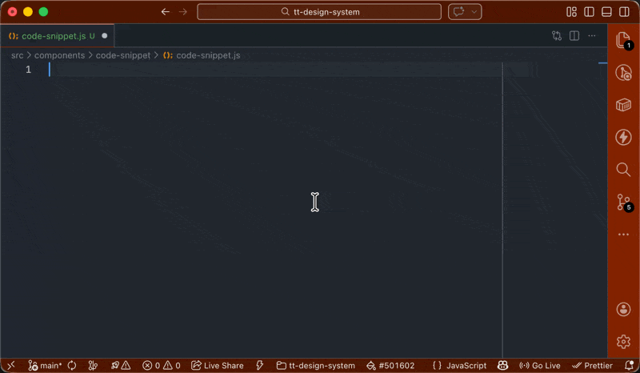
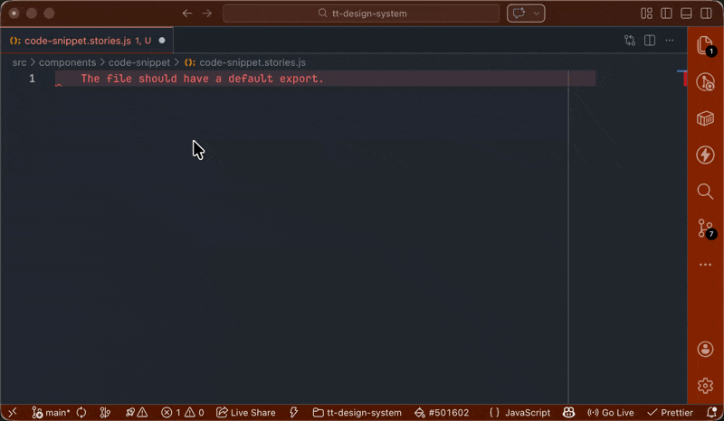

A design system built with [Lit](https://lit.dev/) web components.

## Accessibility

Our a11y baseline is WCAG 2.2 AA.

## Getting Started

This project uses [Storybook](https://storybook.js.org/) for component development, documentation, and testing.

```bash
tt-design-system/
├── .storybook/               # StorybookJS config files.
├── src/                      # Source code for the design system.
│   ├── assets/               # Static assets (images, fonts, etc). Includes global design token CSS.
└── └── components/           # UI components with stories.
```

### Installation

To get started, clone the repository and install the dependencies:

```bash
git clone https://github.com/cherry-picked-solutions/tt-design-system.git
cd tt-design-system
npm install
```

### Running Storybook

See and develop components in Storybook.

```bash
npm start

# Alternatively:
# npm run storybook
```

### Building Storybook

Build a static, hostable, version of the component library. Useful for docs.

```bash
npm run build-storybook
```

## Components

You can find components in `src/components`. Use JSDoc style comments for clear documentation, include CSSProps for theme settings.

### Styling components

Some basic rules to keep in mind when styling components.

1. **Define settings in `:host()`:** Defining CSS vars in `:host()` makes it easy for to theme components without writing CSS overrides.
1. **Let settings cascade:** Set high-level tokens and allow them to flow down to specific parts.
   For example:

   ```mermaid
   flowchart LR
      A[--color-neutral-darkest] --> B[--link-text-color]
      B --> C[--tt-menu-color]
      C --> D[--tt-menu-item-color]
   ```

   - Each component is independent and themable.
   - Works out of the box: Users don't have to modify anything because it comes with good defaults.
   - Auto updates: Changing global colors automatically updates the deepest leaf.

## Recommended VS Code Extensions

| Extension | Description                                                                            |
| :-------- | :------------------------------------------------------------------------------------- |
| Peacock   | Sets custom window colors so you can easily distinguish it from other VS Code windows. |

## Helpers

If you're using VS Code, there are code snippets you can use to help build components and stories quicker.

| Snippet | Description                | Preview                                                                        |
| :------ | :------------------------- | ------------------------------------------------------------------------------ |
| `lcom`  | Scaffold a lit component.  |        |
| `story` | Scaffold a component story |  |
